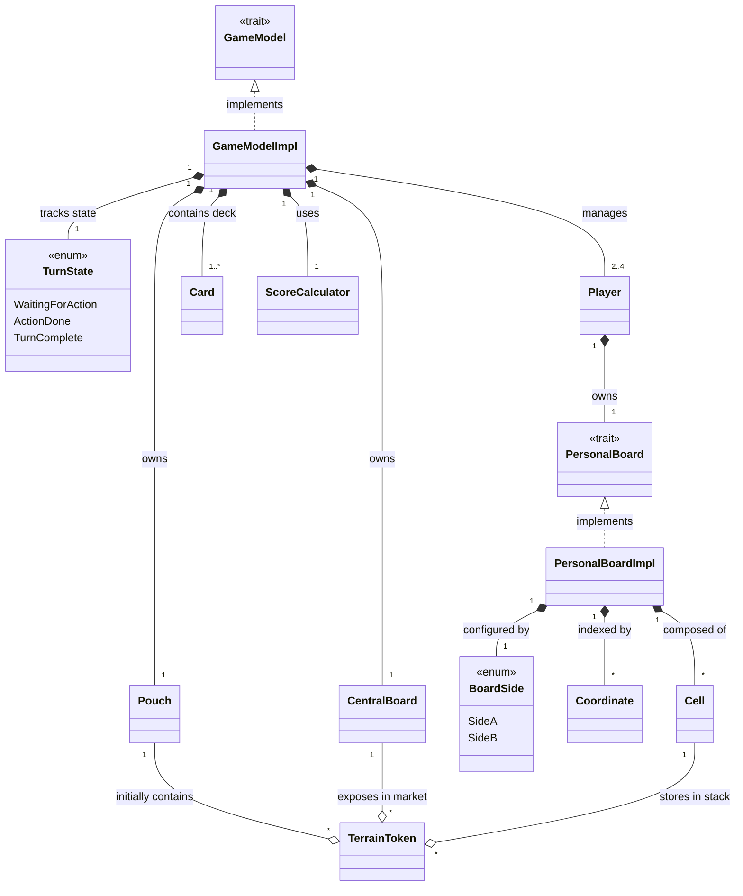
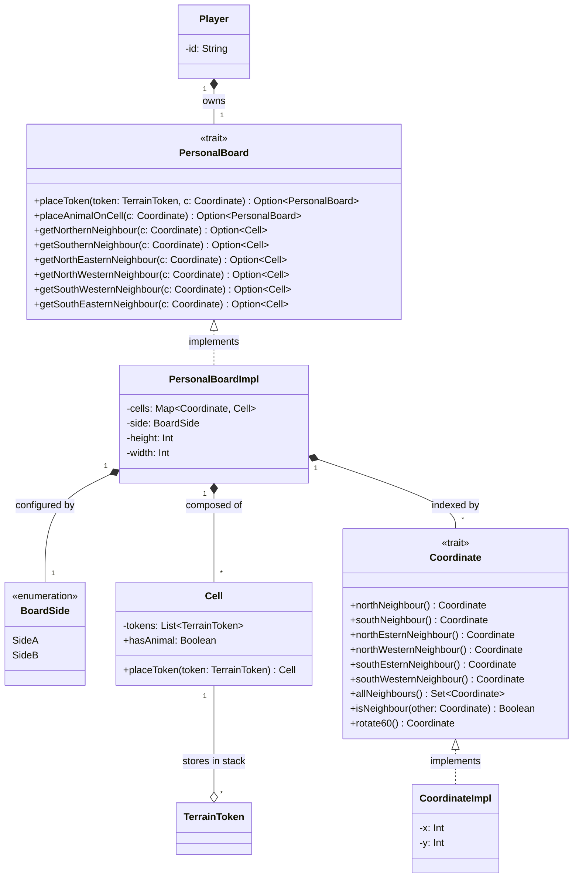
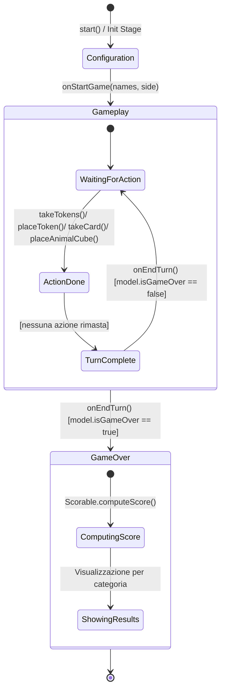
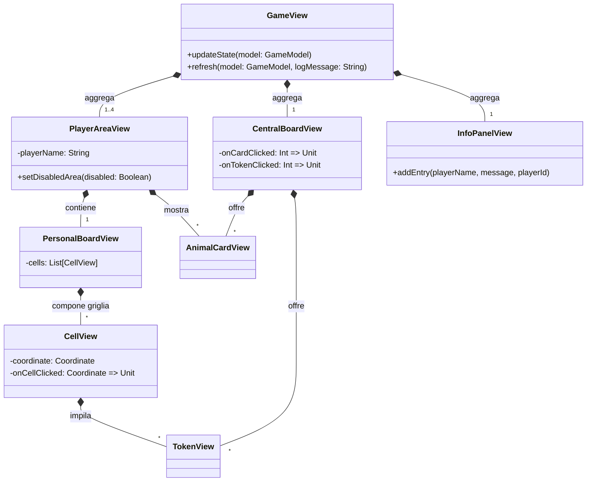
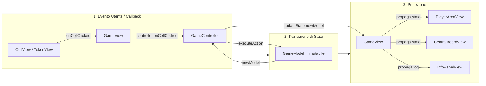

# Model


## Player

# Controller

Il **Controller** funge da mediatore tra l'interfaccia grafica e il model di dominio immutabile, disaccoppiando completamente la logica di presentazione dalle regole di gioco.
La sua responsabilità principale è tradurre gli input dell'utente in transizioni di stato del model (`GameModel`), garantendo la coerenza del flusso del turno e gestendo il ciclo di vita dell'applicazione.

#### 1. Contract-First Design e Information Hiding
Per mantenere un basso accoppiamento, il controller è esposto all'esterno esclusivamente tramite il trait `GameController`, che ne definisce il contratto pubblico:

```scala
trait GameController:
  def currentModel: GameModel
  def currentPlayerId: Int
  def currentTurnState: TurnState
  def onTakeTokens(slot: Int): Unit
  def onSelectToken(token: TerrainToken): Unit
  def onPlaceToken(coordinate: Coordinate): Unit
  def onTakeAnimalCard(slot: Int): Unit
  def onSelectActiveCard(card: AnimalCard): Unit
  def onCellClicked(coordinate: Coordinate): Unit
  def onCancelTurn(): Unit
  def onEndTurn(): Unit
```

L'implementazione concreta (GameControllerImpl) è incapsulata all'interno del companion object tramite un metodo factory (apply).
In questo modo, la View interagisce solo con l'interfaccia astratta, ignorando i dettagli dello stato mutabile interno.

La comunicazione tra logica di controllo e presentazione si basa su una netta separazione delle responsabilità e sull'iniezione delle dipendenze:
* **Input (View $\to$ Controller):** La componente di presentazione (GameView) riceve l'interfaccia GameController nel proprio costruttore per inoltrare reattivamente gli eventi dell'utente (es. click su una cella tramite onCellClicked). La View non possiede alcuna logica decisionale né conosce le regole del gioco.
* **Output (Controller $\to$ View):** L'implementazione interna del controller mantiene un riferimento alla View attiva, pilotandone il rendering deterministico e ordinando l'aggiornamento grafico (`view.updateState(newModel)`) solo a seguito di una transizione di stato avvenuta con successo.

#### 2. Esecuzione Funzionale delle Azioni e Gestione degli Errori
Poiché GameModel è immutabile e lancia eccezioni (IllegalStateException) nel caso in cui una mossa violi le regole del turno o di impilamento, il controller centralizza l'esecuzione delle mutazioni di stato tramite l'esecuzione della higher-order function `executeAction`:
```scala
private def executeAction(action: GameModel => GameModel)(onSuccess: GameModel => Unit): Unit =
  try
    model = action(model)
    onSuccess(model)
  catch case e: IllegalStateException => handleError(e)
```

Mentre il dominio del gioco è un puro sistema di funzioni senza effetti collaterali, l'istanza privata private var model: GameModel del controller rappresenta l'unico punto di mutabilità controllata dell'intera applicazione.
L'assegnamento model = newModel avviene solo all'interno di executeAction, garantendo che lo stato dell'applicazione non possa mai disallinearsi o subire modifiche concorrenti non tracciate.

Questo approccio offre tre vantaggi progettuali:
* **Isolamento delle mutazioni:** La funzione di transizione di stato (action: GameModel => GameModel) viene applicata in un unico punto controllato.
* **Boundary di gestione errori:** Eventuali mosse illegali vengono catturate uniformemente senza far crashare l'applicazione o lasciare la GUI in uno stato inconsistente. Il fallimento viene intercettato da handleError, che notifica la vista per mostrare un feedback temporaneo all'utente (`showTemporaryError`).  
* **Aggiornamento reattivo mirato:** La callback `onSuccess` viene invocata solo a transizione avvenuta con successo, sincronizzando il rendering del nuovo stato nella vista (`view.updateState`) e aggiornando il log di gioco (`refreshView`). 

Il seguente diagramma di sequenza mostra come il controller gestisce l'esecuzione di un'azione (es. piazzamento token) ed eventuali errori.


#### 3. Orchestrazione delle Scene e Flusso di Partita
Il controller amministra la grafica dell'intera applicazione, regolando la transizione tra le tre viste fondamentali senza reciproche dipendenze dirette tra di esse:
* **Bootstrap (start):** Inizializza l'applicazione mostrando la schermata di configurazione (HomeView) e passando la callback onStartGame.
* **Gameplay (onStartGame):** Crea la lista dei giocatori e l'istanza iniziale di GameModel, impostando GameView come radice della scena. 
* **Terminazione (onEndTurn -> onEndGame):** A ogni fine turno, verifica la condizione d'arresto (`model.isGameOver`); se soddisfatta, sostituisce la vista di gioco con ScoreCalculatorView per il calcolo e la visualizzazione del punteggio finale



# View

La **View** costituisce il livello di presentazione del sistema, realizzata avvalendosi della libreria grafica **ScalaFX**.
I componenti visivi sono completamente privi di logica decisionale o di regole di dominio, hanno il solo compito di proiettare visivamente lo stato immutabile del gioco (`GameModel`) e di intercettare le interazioni dell'utente, inoltrandole al `GameController`.

#### 1. Architettura Composizionale e Gerarchia dei Componenti
Per evitare strutture monolitiche e facilitare la manutenzione, l'interfaccia di gioco (`GameView`) è organizzata secondo una struttura ad albero fortemente coesa e gerarchica. La vista principale agisce da orchestratore visivo, aggregando macro-aree funzionali indipendenti che, a loro volta, compongono elementi atomici riutilizzabili:

* **`PlayerAreaView`:** Aggrega e organizza l'area individuale di ciascun giocatore, contenendo la plancia personale (`PersonalBoardView`), la mano di carte animale attive e lo storico delle carte completate.
* **`PersonalBoardView` e `CellView`:** Gestiscono il rendering esagonale della griglia di gioco. `PersonalBoardView` mappa le coordinate del model sul piano cartesiano, istanziando le singole `CellView` che disegnano i poligoni esagonali e impilano i segnalini (`TokenView`) e i cubi animale.
* **`CentralBoardView`:** Rappresenta l'offerta pubblica comune, organizzando gli slot dei dischi terreno prelevabili, le carte animale del mercato e il contatore del sacchetto residuo (`Pouch`).
* **`InfoPanelView`:** Fornisce un log di gioco reattivo che traccia cronologicamente lo storico dei turni e le azioni intraprese dai giocatori.

Il seguente diagramma delle classi illustra la gerarchia composizionale della vista di gioco e le relazioni tra i componenti:



#### 2. Disaccoppiamento Funzionale tramite Callbacks

Per garantire che i singoli componenti grafici della gerarchia (come `CellView`, `TokenView` o `AnimalCardView`) siano riutilizzabili e testabili in isolamento, nessun componente grafico di dettaglio possiede un riferimento diretto al `GameController` o al `GameModel`.
La gestione degli eventi di input (click su un token, selezione di una cella, scelta di una carta) è interamente disaccoppiata tramite il passaggio di funzioni di callback (Higher-Order Functions) iniettate nel costruttore dei componenti:

```scala
case class CellView(
    coordinate: Coordinate,
    var cell: Cell,
    pos: (Double, Double) = (0.0, 0.0),
    onCellClicked: Coordinate => Unit,
    highlighted: Boolean
) extends StackPane:
  onMouseClicked = _ => onCellClicked(coordinate)
```

#### 3. Rendering Deterministico e Proiezione dello Stato

In accordo con l'architettura funzionale del model, la View non conserva uno stato locale mutabile relativo alle regole o all'avanzamento della partita.
L'aggiornamento dell'interfaccia si basa sul principio di proiezione deterministica dello stato:
Quando il controller completa una transizione di turno valida, invoca il metodo `view.updateState(newModel)`, passando la nuova istanza immutabile di GameModel.
La GameView estrae dallo snapshot le informazioni rilevanti e propaga in modo discendente l'aggiornamento a tutte le sotto-viste.
Questo design garantisce che l'interfaccia grafica sia sempre una rappresentazione fedele e coerente dello stato corrente del model.



#### 4. Isolamento delle Viste nel Ciclo di Vita
L'interfaccia dell'applicazione è disaccoppiata in tre macro-schermate principali, ciascuna responsabile di una specifica fase del ciclo di vita del gioco:
* **HomeView:** Gestisce il bootstrap, la configurazione dei giocatori (nomi, numero di partecipanti) e la scelta del lato della plancia (SideA o SideB), integrando un tutorial interattivo sulle regole.
* **GameView:** Rappresenta l'ambiente del gameplay attivo.
* **ScoreCalculatorView:** Costituisce la schermata di terminazione della partita, calcolando e mostrando la ripartizione del punteggio finale per ogni singola categoria di terreno e per le carte animale in uno stile di riepilogo tabellare.

Le tre schermate sono classi del tutto indipendenti e non comunicano tra loro: la transizione da un contesto all'altro è governata unicamente dallo stage manager del GameController.  