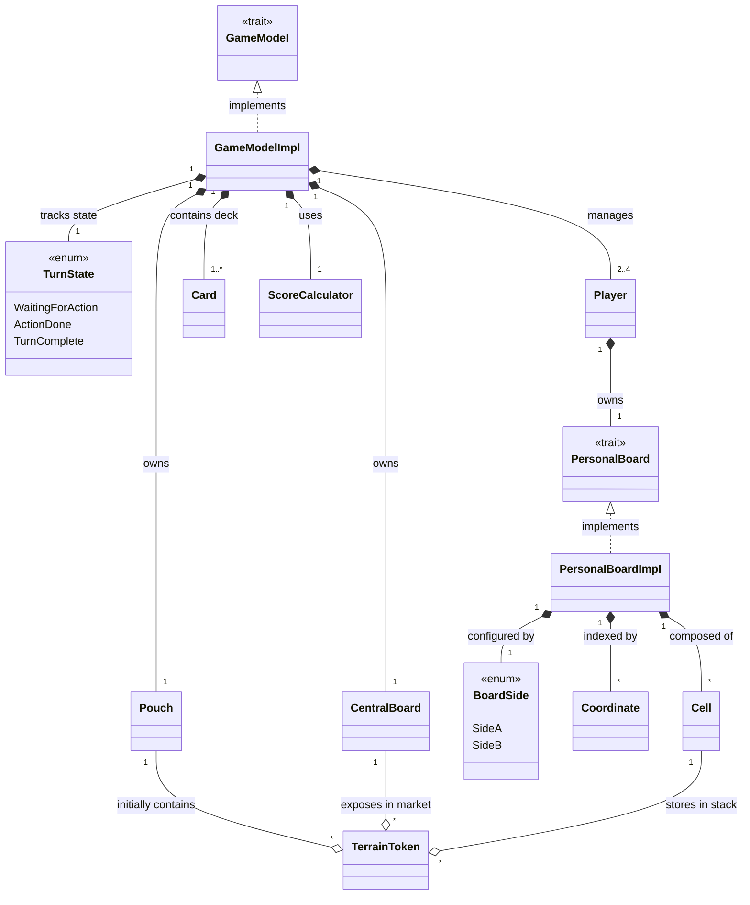
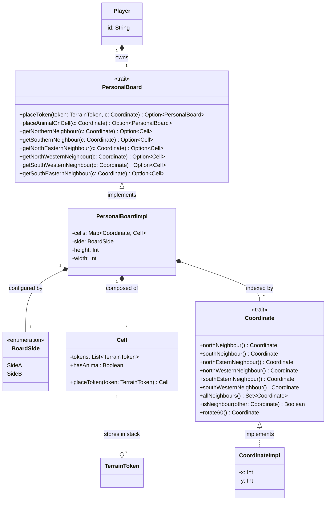

# Model

```mermaid
classDiagram
    direction TB

%% Interfaces and Main Model
    class GameModel {
        <<trait>>
       
    }

    class GameModelImpl {
        
    }

    class TurnState {
        <<enum>>
        WaitingForAction
        ActionDone
        TurnComplete
    }

    class CentralBoard {
    }

    class Pouch {
    }

    class Player {
    }

    class Card {
    }

    class PersonalBoard {
        <<trait>>
    }

    class PersonalBoardImpl {
    }

    class BoardSide {
        <<enum>>
        SideA
        SideB
    }

    class Coordinate {
    }

    class Cell {
    }

    class TerrainToken {
    }

%% GameModel Relationships
    GameModel <|.. GameModelImpl : implements
    GameModelImpl "1" *-- "1" TurnState : tracks state
    GameModelImpl "1" *-- "2..4" Player : manages
    GameModelImpl "1" *-- "1..*" Card : contains deck
    GameModelImpl "1" *-- "1" ScoreCalculator : uses
    GameModelImpl "1" *-- "1" CentralBoard : owns
    GameModelImpl "1" *-- "1" Pouch : owns

%% Player & PersonalBoard Relationships
    Player "1" *-- "1" PersonalBoard : owns
    PersonalBoard <|.. PersonalBoardImpl : implements
    PersonalBoardImpl "1" *-- "1" BoardSide : configured by
    PersonalBoardImpl "1" *-- "*" Cell : composed of
    PersonalBoardImpl "1" *-- "*" Coordinate : indexed by

%% TerrainToken Lifecycle / Containers
    Pouch "1" --o "*" TerrainToken : initially contains
    CentralBoard "1" --o "*" TerrainToken : exposes in market
    Cell "1" --o "*" TerrainToken : stores in stack
```

## Player

```mermaid
classDiagram
    direction TB

    class Player {
        -id: String
    }

    class PersonalBoard {
        <<trait>>
        +placeToken(token: TerrainToken, c: Coordinate) Option~PersonalBoard~
        +placeAnimalOnCell(c: Coordinate) Option~PersonalBoard~
        +getNorthernNeighbour(c: Coordinate) Option~Cell~
        +getSouthernNeighbour(c: Coordinate) Option~Cell~
        +getNorthEasternNeighbour(c: Coordinate) Option~Cell~
        +getNorthWesternNeighbour(c: Coordinate) Option~Cell~
        +getSouthWesternNeighbour(c: Coordinate) Option~Cell~
        +getSouthEasternNeighbour(c: Coordinate) Option~Cell~
    }

    class PersonalBoardImpl {
        -cells: Map~Coordinate, Cell~
        -side: BoardSide
        -height: Int
        -width: Int
    }

    class BoardSide {
        <<enumeration>>
        SideA
        SideB
    }

    class Coordinate {
        <<trait>>
        +northNeighbour() Coordinate
        +southNeighbour() Coordinate
        +northEsternNeighbour() Coordinate
        +northWesternNeighbour() Coordinate
        +southEsternNeighbour() Coordinate
        +southWesternNeighbour() Coordinate
        +allNeighbours() Set~Coordinate~
        +isNeighbour(other: Coordinate) Boolean
        +rotate60() Coordinate
    }

    class CoordinateImpl {
        -x: Int
        -y: Int
    }

    class Cell {
        -tokens: List~TerrainToken~
        +hasAnimal: Boolean
        +placeToken(token: TerrainToken) Cell
    }

    class TerrainToken {
        
    }

    %% Relationships
    Player "1" *-- "1" PersonalBoard : owns
    PersonalBoard <|.. PersonalBoardImpl : implements
    Coordinate <|.. CoordinateImpl : implements

    PersonalBoardImpl "1" *-- "1" BoardSide : configured by
    PersonalBoardImpl "1" *-- "*" Cell : composed of
    PersonalBoardImpl "1" *-- "*" Coordinate : indexed by
    Cell "1" --o "*" TerrainToken : stores in stack
```
