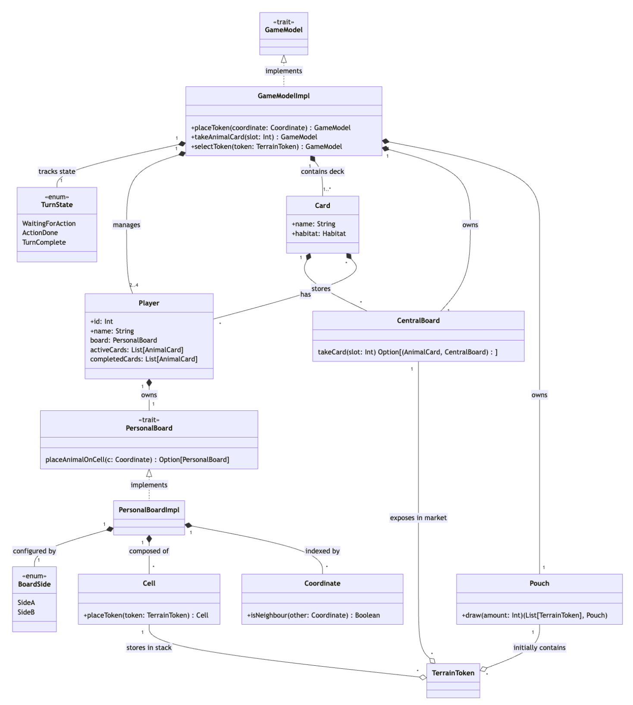
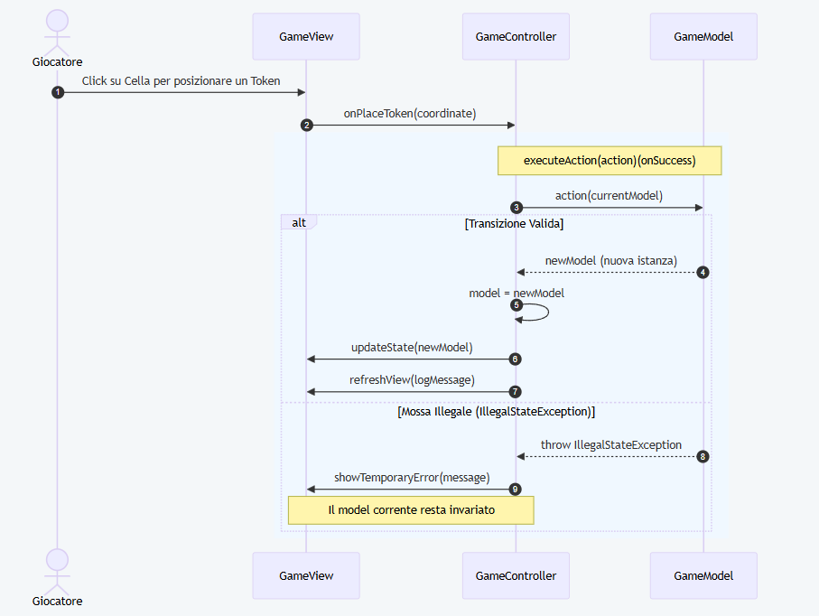
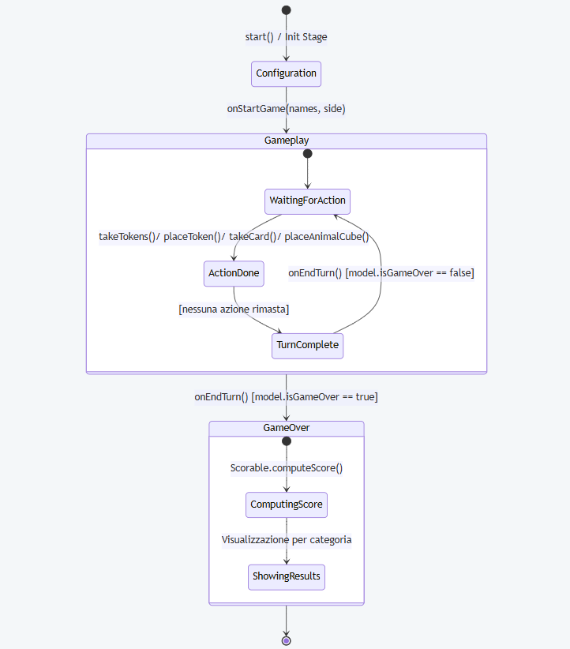
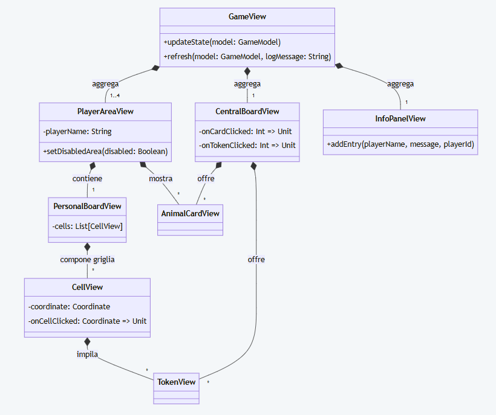
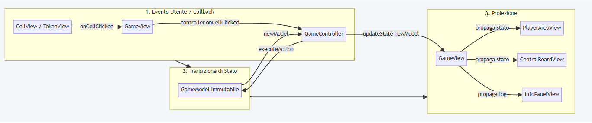

# Model
L'architettura del dominio è stata progettata valorizzando la modularità e la netta separazione delle responsabilità tra i componenti. 
Il diagramma delle classi sottostante sintetizza la struttura complessiva, illustrando le relazioni e le composizioni fondamentali tra le entità di gioco.




## Player e Card
`Player` è la `case class` che rappresenta il partecipante alla partita e ne raccoglie lo stato complessivo: l'identificativo, il nome, la plancia personale (`PersonalBoard`), l'insieme delle carte animale in corso di completamento (`activeCards`) e quelle già completate (`completedCards`).


## PersonalBoard e BoardSide
`PersonalBoard` rappresenta la plancia individuale su cui ciascun giocatore costruisce il proprio paesaggio esagonale. Il regolamento prevede due differenti layout di gioco (`SideA` e `SideB`), modellati tramite l'enumerazione `BoardSide`, che definisce in modo chiuso le configurazioni disponibili in termini di dimensioni e numero di celle valide.

Sul piano progettuale, `PersonalBoard` è definita come un `trait` pubblico, mentre la sua implementazione concreta `PersonalBoardImpl` è mantenuta `private` all'interno del relativo companion object. In questo modo il resto del sistema dipende esclusivamente dall'astrazione e mai dai dettagli realizzativi. 

Le operazioni di piazzamento dei tasselli (`placeToken`) e dei cubi animale (`placeAnimalOnCell`) seguono una logica rigorosamente immutabile, restituendo un `Option[PersonalBoard]` aggiornato: l'uso del tipo `Option` garantisce la gestione sicura dei casi limite e delle coordinate invalide senza ricorrere ad eccezioni. Inoltre, gli algoritmi di analisi del paesaggio (come la ricerca delle coordinate per tipo di terreno `coordsWithTerrain` e l'individuazione dei gruppi connessi adiacenti `findConnectedGroups` per il calcolo dei punteggi) sono modellati come *Extension Methods*.

## Coordinate e Cell
La gestione dello spazio e dei contenitori fisici della plancia è affidata alla coppia `Coordinate` e `Cell`.

`Coordinate` costituisce l'astrazione per la rappresentazione delle posizioni bidimensionali (x, y) su griglia esagonale. È modellata come un `trait` astratto con implementazione privata `CoordinateImpl`. Il trait incapsula l'aritmetica vettoriale (`+`, `-`, `*`), la rotazione a 60° (`rotate60`) e la navigazione verso i sei vicini adiacenti (`northNeighbour`, `southEasternNeighbour`, ecc.), isolando la plancia da qualsiasi calcolo geometrico di basso livello.

`Cell` rappresenta la singola posizione esagonale sulla plancia e funge da contenitore sia per la pila di `TerrainToken`, sia per l'eventuale cubo animale. La classe è modellata come una `case class` immutabile in cui i token sovrapposti sono gestiti come una lista LIFO (*Last-In, First-Out*). L'accesso al token affiorante (`topToken`) e il posizionamento dei cubi animale (`occupyWithAnimal`) sfruttano il tipo `Option` per validare lo stato ed evitare mosse non consentite (es. piazzare un cubo animale su celle vuote o già occupate).

## GameModel e TurnState
`GameModel` rappresenta la facciata e il punto di coordinamento centrale dell'intero modello di dominio. Espone le operazioni pubbliche per guidare l'evoluzione della partita: il prelievo dei tasselli, la scelta e il posizionamento delle carte animale, il piazzamento dei token terreno e dei cubi animale, fino alla conclusione del turno o dell'intero gioco.

Sul piano architetturale, `GameModel` è definito come un `trait` pubblico, mentre la sua implementazione concreta `GameModelImpl` è mantenuta `private` all'interno del companion object. Esso funge da *Factory* mettendo a disposizione metodi `apply` sia per la creazione del gioco standard sia per scenari di test (es. forzando il sacchetto vuoto). Per garantire la flessibilità dell'esperienza utente, `GameModelImpl` implementa un meccanismo di ripristino del turno: salvando una copia immutabile dello stato all'inizio del turno (`turnSnapshot`), la funzione `cancelTurn` consente al giocatore di annullare le azioni correnti e ripristinare lo stato iniziale.

La gestione delle fasi del turno è formalizzata tramite l'enumerazione `TurnState`, che rappresenta l'insieme finito degli stati che un turno può assumere (`WaitingForAction`, `ActionDone`, `TurnComplete`). Il ciclo di vita del turno è gestito come una macchina a stati finiti: prima di eseguire un'operazione, il model verifica che essa sia consentita nello stato corrente lasciando il compito di rifiutare mosse illegali a eccezioni di stato (`IllegalStateException`), garantendo che il sistema non transiti mai verso configurazioni non valide.


## CentralBoard e Pouch
La plancia centrale (`CentralBoard`) e il sacchetto (`Pouch`) modellano il mercato comune da cui i giocatori attingono le risorse durante il proprio turno.

`CentralBoard` offre gli slot pubblici per la selezione dei tasselli terreno e delle carte animale. Le sue operazioni (`takeTokens`, `takeCard`) restituiscono una tupla contenente l'elemento prelevato e una nuova istanza aggiornata della plancia centrale, preservando la rigorosa immutabilità dello stato. Il riempimento degli slot scoperti è delegato al metodo `fill`, che coordina l'estrazione sincrona dei token dal sacchetto e delle carte dal mazzo.

`Pouch` rappresenta il contenitore fisico dei `TerrainToken` non ancora estratti. Viene inizializzato tramite il factory method `initialPouch()` e gestisce la popolazione dei tasselli in modo totalmente isolato. La sua dimensione (`pouchSize`) è una delle condizioni primarie monitorate da `GameModel` per determinare l'innesco dell'ultimo round di gioco (`isLastRound`).


## AnimalCard e AnimalDeckFactory
Le carte animale (`AnimalCard`) rappresentano gli obiettivi di punteggio che i giocatori possono acquisire dalla plancia centrale per poi completare sulla propria `PersonalBoard`.

Ogni carta definisce il numero massimo di cubi animale che può ospitare (`maxCubes`), i cubi attualmente piazzati (`placedCubes`) e la configurazione di habitat richiesta (`habitat`). Il posizionamento di un cubo viene validato mediante l'ausilio del modulo `HabitatMatcher`, che analizza la topologia della plancia personale per identificare le corrispondenze valide. Quando una carta raggiunge il limite massimo di cubi, la transizione dal gruppo delle carte attive (`activeCards`) a quelle completate (`completedCards`) avviene in modo automatico all'interno del `GameModel`.

La creazione e il mescolamento iniziale del mazzo sono isolati all'interno di `AnimalDeckFactory`, un modulo *Factory* dedicato che garantisce la casualità della disposizione delle carte all'avvio della partita.

# Controller

Il **Controller** funge da mediatore tra l'interfaccia grafica e il model di dominio immutabile, disaccoppiando completamente la logica di presentazione dalle regole di gioco.
La sua responsabilità principale è tradurre gli input dell'utente in transizioni di stato del model (`GameModel`), garantendo la coerenza del flusso del turno e gestendo il ciclo di vita dell'applicazione.

#### 1. Contract-First Design e Information Hiding
Per mantenere un basso accoppiamento, il controller è esposto all'esterno esclusivamente tramite il trait `GameController`, che ne definisce il contratto pubblico:

```scala
trait GameController:
  def currentModel: GameModel
  def currentPlayerId: Int
  def currentTurnState: TurnState
  def onTakeTokens(slot: Int): Unit
  def onSelectToken(token: TerrainToken): Unit
  def onPlaceToken(coordinate: Coordinate): Unit
  def onTakeAnimalCard(slot: Int): Unit
  def onSelectActiveCard(card: AnimalCard): Unit
  def onCellClicked(coordinate: Coordinate): Unit
  def onCancelTurn(): Unit
  def onEndTurn(): Unit
```

L'implementazione concreta (GameControllerImpl) è incapsulata all'interno del companion object tramite un metodo factory (apply).
In questo modo, la View interagisce solo con l'interfaccia astratta, ignorando i dettagli dello stato mutabile interno.

La comunicazione tra logica di controllo e presentazione si basa su una netta separazione delle responsabilità e sull'iniezione delle dipendenze:
* **Input (View $\to$ Controller):** La componente di presentazione (GameView) riceve l'interfaccia GameController nel proprio costruttore per inoltrare reattivamente gli eventi dell'utente (es. click su una cella tramite onCellClicked). La View non possiede alcuna logica decisionale né conosce le regole del gioco.
* **Output (Controller $\to$ View):** L'implementazione interna del controller mantiene un riferimento alla View attiva, pilotandone il rendering deterministico e ordinando l'aggiornamento grafico (`view.updateState(newModel)`) solo a seguito di una transizione di stato avvenuta con successo.

#### 2. Esecuzione Funzionale delle Azioni e Gestione degli Errori
Poiché GameModel è immutabile e lancia eccezioni (IllegalStateException) nel caso in cui una mossa violi le regole del turno o di impilamento, il controller centralizza l'esecuzione delle mutazioni di stato tramite l'esecuzione della higher-order function `executeAction`:
```scala
private def executeAction(action: GameModel => GameModel)(onSuccess: GameModel => Unit): Unit =
  try
    model = action(model)
    onSuccess(model)
  catch case e: IllegalStateException => handleError(e)
```

Mentre il dominio del gioco è un puro sistema di funzioni senza effetti collaterali, l'istanza privata `private var model: GameModel` del controller rappresenta l'unico punto di mutabilità controllata dell'intera applicazione.
L'assegnamento `model = newModel` avviene solo all'interno di executeAction, garantendo che lo stato dell'applicazione non possa mai disallinearsi o subire modifiche concorrenti non tracciate.

Questo approccio offre tre vantaggi progettuali:
* **Isolamento delle mutazioni:** La funzione di transizione di stato `(action: GameModel => GameModel)` viene applicata in un unico punto controllato.
* **Boundary di gestione errori:** Eventuali mosse illegali vengono catturate uniformemente senza far crashare l'applicazione o lasciare la GUI in uno stato inconsistente. Il fallimento viene intercettato da handleError, che notifica la vista per mostrare un feedback temporaneo all'utente (`showTemporaryError`).  
* **Aggiornamento reattivo mirato:** La callback `onSuccess` viene invocata solo a transizione avvenuta con successo, sincronizzando il rendering del nuovo stato nella vista (`view.updateState`) e aggiornando il log di gioco (`refreshView`). 

Il seguente diagramma di sequenza mostra come il controller gestisce l'esecuzione di un'azione (es. piazzamento token) ed eventuali errori.


#### 3. Orchestrazione delle Scene e Flusso di Partita
Il controller amministra la grafica dell'intera applicazione, regolando la transizione tra le tre viste fondamentali senza reciproche dipendenze dirette tra di esse:
* **Bootstrap (start):** Inizializza l'applicazione mostrando la schermata di configurazione (HomeView) e passando la callback onStartGame.
* **Gameplay (onStartGame):** Crea la lista dei giocatori e l'istanza iniziale di GameModel, impostando GameView come radice della scena. 
* **Terminazione (onEndTurn -> onEndGame):** A ogni fine turno, verifica la condizione d'arresto (`model.isGameOver`); se soddisfatta, sostituisce la vista di gioco con ScoreCalculatorView per il calcolo e la visualizzazione del punteggio finale


# View

La **View** costituisce il livello di presentazione del sistema, realizzata avvalendosi della libreria grafica **ScalaFX**.
I componenti visivi sono completamente privi di logica decisionale o di regole di dominio, hanno il solo compito di proiettare visivamente lo stato immutabile del gioco (`GameModel`) e di intercettare le interazioni dell'utente, inoltrandole al `GameController`.

#### 1. Architettura Composizionale e Gerarchia dei Componenti
Per evitare strutture monolitiche e facilitare la manutenzione, l'interfaccia di gioco (`GameView`) è organizzata secondo una struttura ad albero fortemente coesa e gerarchica. La vista principale agisce da orchestratore visivo, aggregando macro-aree funzionali indipendenti che, a loro volta, compongono elementi atomici riutilizzabili:

* **`PlayerAreaView`:** Aggrega e organizza l'area individuale di ciascun giocatore, contenendo la plancia personale (`PersonalBoardView`), la mano di carte animale attive e lo storico delle carte completate.
* **`PersonalBoardView` e `CellView`:** Gestiscono il rendering esagonale della griglia di gioco. `PersonalBoardView` mappa le coordinate del model sul piano cartesiano, istanziando le singole `CellView` che disegnano i poligoni esagonali e impilano i segnalini (`TokenView`) e i cubi animale.
* **`CentralBoardView`:** Rappresenta l'offerta pubblica comune, organizzando gli slot dei dischi terreno prelevabili, le carte animale del mercato e il contatore del sacchetto residuo (`Pouch`).
* **`InfoPanelView`:** Fornisce un log di gioco reattivo che traccia cronologicamente lo storico dei turni e le azioni intraprese dai giocatori.

Il seguente diagramma delle classi illustra la gerarchia composizionale della vista di gioco e le relazioni tra i componenti:



#### 2. Disaccoppiamento Funzionale tramite Callbacks

Per garantire che i singoli componenti grafici della gerarchia (come `CellView`, `TokenView` o `AnimalCardView`) siano riutilizzabili e testabili in isolamento, nessun componente grafico di dettaglio possiede un riferimento diretto al `GameController` o al `GameModel`.
La gestione degli eventi di input (click su un token, selezione di una cella, scelta di una carta) è interamente disaccoppiata tramite il passaggio di funzioni di callback (Higher-Order Functions) iniettate nel costruttore dei componenti:

```scala
case class CellView(
    coordinate: Coordinate,
    var cell: Cell,
    pos: (Double, Double) = (0.0, 0.0),
    onCellClicked: Coordinate => Unit,
    highlighted: Boolean
) extends StackPane:
  onMouseClicked = _ => onCellClicked(coordinate)
```

#### 3. Rendering Deterministico e Proiezione dello Stato

In accordo con l'architettura funzionale del model, la View non conserva uno stato locale mutabile relativo alle regole o all'avanzamento della partita.
L'aggiornamento dell'interfaccia si basa sul principio di proiezione deterministica dello stato:
Quando il controller completa una transizione di turno valida, invoca il metodo `view.updateState(newModel)`, passando la nuova istanza immutabile di GameModel.
La GameView estrae dallo snapshot le informazioni rilevanti e propaga in modo discendente l'aggiornamento a tutte le sotto-viste.
Questo design garantisce che l'interfaccia grafica sia sempre una rappresentazione fedele e coerente dello stato corrente del model.



#### 4. Isolamento delle Viste nel Ciclo di Vita
L'interfaccia dell'applicazione è disaccoppiata in tre macro-schermate principali, ciascuna responsabile di una specifica fase del ciclo di vita del gioco:
* **HomeView:** Gestisce il bootstrap, la configurazione dei giocatori (nomi, numero di partecipanti) e la scelta del lato della plancia (SideA o SideB), integrando un tutorial interattivo sulle regole.
* **GameView:** Rappresenta l'ambiente del gameplay attivo.
* **ScoreCalculatorView:** Costituisce la schermata di terminazione della partita, calcolando e mostrando la ripartizione del punteggio finale per ogni singola categoria di terreno e per le carte animale in uno stile di riepilogo tabellare.

Le tre schermate sono classi del tutto indipendenti e non comunicano tra loro: la transizione da un contesto all'altro è governata unicamente dallo stage manager del GameController.  