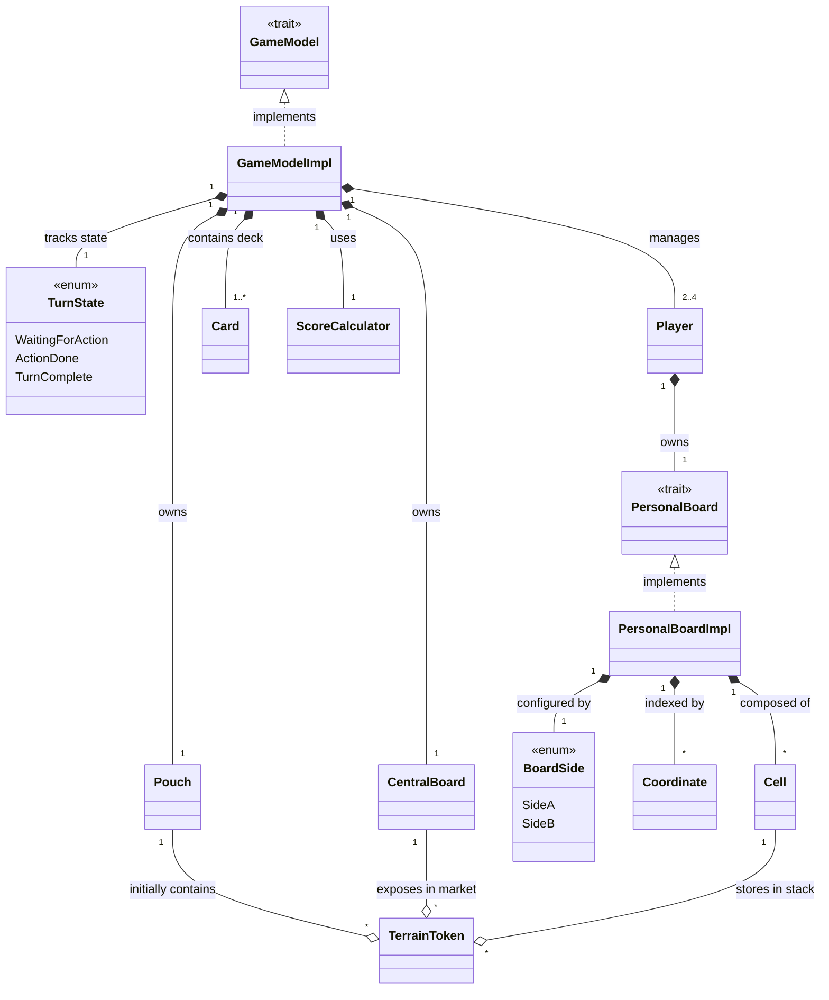
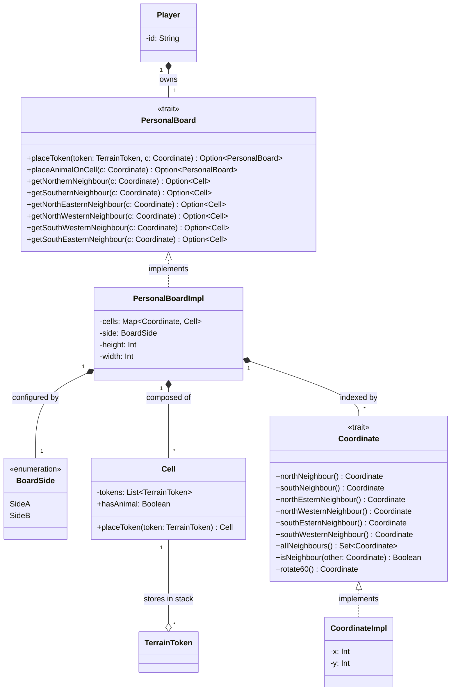
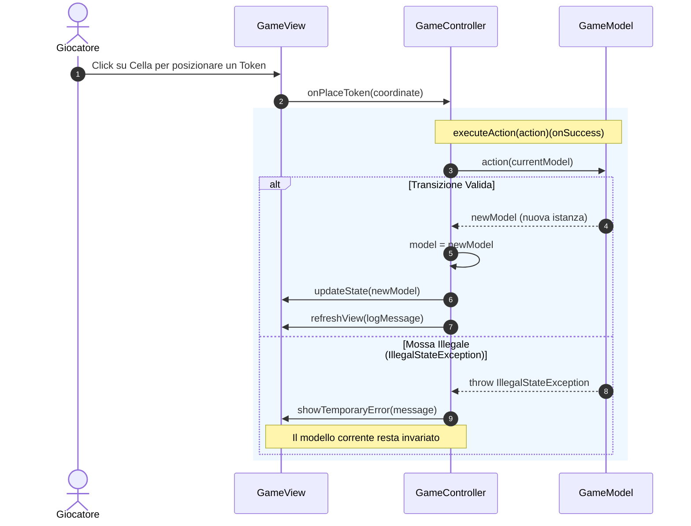
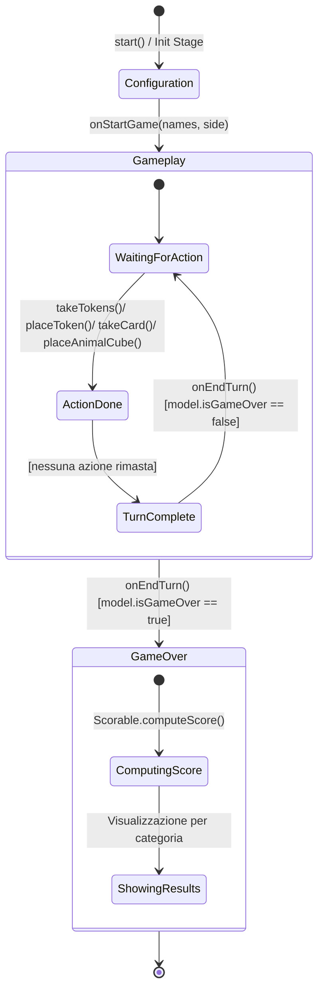

# Model


## Player

# Controller

Il **Controller** funge da mediatore tra l'interfaccia grafica e il modello di dominio immutabile, disaccoppiando completamente la logica di presentazione dalle regole di gioco.
La sua responsabilità principale è tradurre gli input dell'utente in transizioni di stato del modello (`GameModel`), garantendo la coerenza del flusso del turno e gestendo il ciclo di vita dell'applicazione.

#### 1. Contract-First Design e Information Hiding
Per mantenere un basso accoppiamento, il controller è esposto all'esterno esclusivamente tramite il trait `GameController`, che ne definisce il contratto pubblico:

```scala
trait GameController:
  def currentModel: GameModel
  def currentPlayerId: Int
  def currentTurnState: TurnState
  def onTakeTokens(slot: Int): Unit
  def onSelectToken(token: TerrainToken): Unit
  def onPlaceToken(coordinate: Coordinate): Unit
  def onTakeAnimalCard(slot: Int): Unit
  def onSelectActiveCard(card: AnimalCard): Unit
  def onCellClicked(coordinate: Coordinate): Unit
  def onCancelTurn(): Unit
  def onEndTurn(): Unit
```

L'implementazione concreta (GameControllerImpl) è incapsulata all'interno del companion object tramite un metodo factory (apply).
In questo modo, la View interagisce solo con l'interfaccia astratta, ignorando i dettagli dello stato mutabile interno.

#### 2. Esecuzione Funzionale delle Azioni e Gestione degli Errori
Poiché GameModel è immutabile e lancia eccezioni (IllegalStateException) nel caso in cui una mossa violi le regole del turno o di impilamento, il controller centralizza l'esecuzione delle mutazioni di stato tramite l'esecuzione della higher-order function `executeAction`:
```scala
private def executeAction(action: GameModel => GameModel)(onSuccess: GameModel => Unit): Unit =
  try
    model = action(model)
    onSuccess(model)
  catch case e: IllegalStateException => handleError(e)
```

Questo approccio offre tre vantaggi progettuali:
* **Isolamento delle mutazioni:** La funzione di transizione di stato (action: GameModel => GameModel) viene applicata in un unico punto controllato.
* **Boundary di gestione errori:** Eventuali mosse illegali vengono catturate uniformemente senza far crashare l'applicazione o lasciare la GUI in uno stato inconsistente. Il fallimento viene intercettato da handleError, che notifica la vista per mostrare un feedback temporaneo all'utente (`showTemporaryError`).  
* **Aggiornamento reattivo mirato:** La callback `onSuccess` viene invocata solo a transizione avvenuta con successo, sincronizzando il rendering del nuovo stato nella vista (`view.updateState`) e aggiornando il log di gioco (`refreshView`). 

Il seguente diagramma di sequenza mostra come il controller gestisce l'esecuzione di un'azione (es. piazzamento token) ed eventuali errori.



#### 3. Orchestrazione delle Scene e Flusso di Partita
Il controller amministra la grafica dell'intera applicazione, regolando la transizione tra le tre viste fondamentali senza reciproche dipendenze dirette tra di esse:
* **Bootstrap (start):** Inizializza l'applicazione mostrando la schermata di configurazione (HomeView) e passando la callback onStartGame.
* **Gameplay (onStartGame):** Crea la lista dei giocatori e l'istanza iniziale di GameModel, impostando GameView come radice della scena. 
* **Terminazione (onEndTurn -> onEndGame):** A ogni fine turno, verifica la condizione d'arresto (`model.isGameOver`); se soddisfatta, sostituisce la vista di gioco con ScoreCalculatorView per il calcolo e la visualizzazione del punteggio finale

