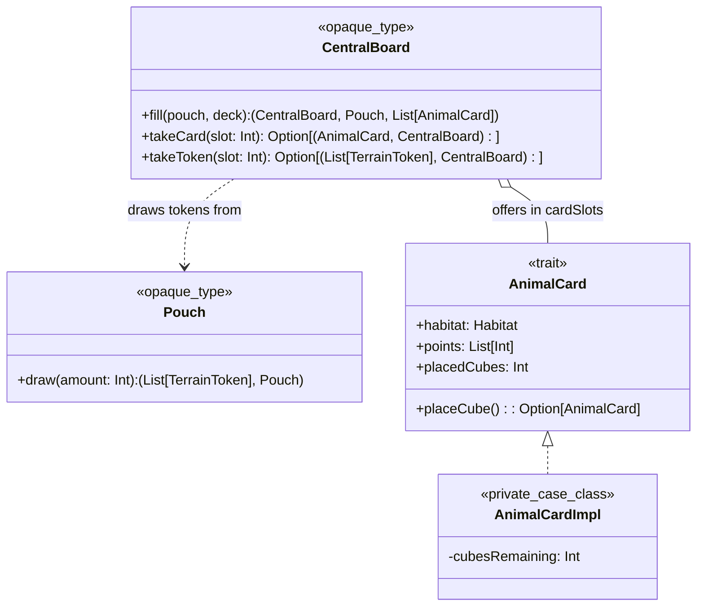
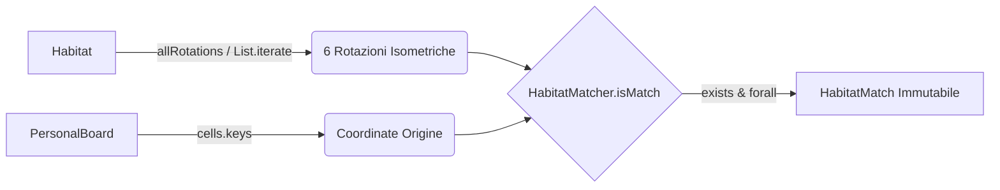

# Implementation

## Oluwatobi Daniel Ariyo

## Filippo Ferretti

### 1. Zero-Cost Encapsulation e Trasparenza Referenziale: `Pouch` e `CentralBoard`

#### 1.1 Sacchetti e Determinismo Aleatorio (`Pouches`)
Il sacchetto di gioco, responsabile dell'estrazione dei segnalini terreno, è stato modellato come un **`opaque type`** basato su lista (`opaque type Pouch = List[TerrainToken]`). Questo design offre un doppio vantaggio: impedisce ai client esterni di manipolare direttamente la collezione sottostante e azzera l'overhead di allocazione a runtime.

* **Trasparenza referenziale:** L'operazione di estrazione `draw(amount: Int)` non causa alcun *side-effect* sulla collezione. Sfruttando `p.splitAt(amount)`, il metodo restituisce una tupla immutabile `(List[TerrainToken], Pouch)` che separa i token estratti dal nuovo stato residuo del sacchetto:
  ```scala
  extension (p: Pouch)
    def draw(amount: Int): (List[TerrainToken], Pouch) =
      p.splitAt(amount)
  ```
* **Determinismo per i test di regressione:** Per supportare appieno il TDD, la casualità del rimescolamento `(Random.shuffle)` è stata incapsulata iniettando un parametro `seed: Long = Random.nextLong()` nei metodi factory apply e initialPouch. Nei test automatizzati è quindi possibile fissare il seed, rendendo l'estrazione perfettamente ripetibile.

#### 1.2 Offerta Centrale Immutabile (`CentralBoards`)
La plancia centrale, che ospita i 5 slot pubblici per i token e per le carte animale (`SlotIds = List(1, 2, 3, 4, 5)`), è stata analoga rappresentata con un opaque type:
  ```scala
  private case class OfferState(
    tokenSlots: Map[Int, List[TerrainToken]],
    cardSlots: Map[Int, Option[AnimalCard]]
  )
  opaque type CentralBoard = OfferState
  ```
* **Ripristino funzionale (`fill`):** Il riempimento degli slot vuoti avviene senza mutazione di stato attraverso combinatori `foldLeft`. A ogni passo, se uno slot risulta vuoto, viene generata una mappa aggiornata insieme al nuovo stato del sacchetto e del mazzo, restituendo la tupla `(CentralBoard, Pouch, List[AnimalCard])`:
```scala
  def fill(pouch: Pouch, deck: List[AnimalCard]): (CentralBoard, Pouch, List[AnimalCard]) =
        val (nextTokens, nextPouch) = SlotIds.foldLeft((b.tokenSlots, pouch)):
          case ((currentSlots, currentPouch), slotId) =>
            if currentSlots.get(slotId).exists(_.isEmpty) then
              val (drawnTokens, updatedPouch) = currentPouch.draw(TokensPerSlot)
              (currentSlots.updated(slotId, drawnTokens), updatedPouch)
            else (currentSlots, currentPouch)

        val (nextCards, nextDeck) = SlotIds.foldLeft((b.cardSlots, deck)):
          case ((currentCards, currentDeck), slotId) =>
            if currentCards(slotId).isEmpty && currentDeck.nonEmpty then
              (
                currentCards.updated(slotId, Some(currentDeck.head)),
                currentDeck.tail
              )
            else (currentCards, currentDeck)
        (OfferState(nextTokens, nextCards), nextPouch, nextDeck)
```

* **Prelievo monadico `(takeCard e takeTokens)`:** Il prelievo di una carta o di un set di token da uno slot sfrutta le for-comprehension su `Option` per validare contestualmente l'esistenza dello slot e la presenza del contenuto:
```scala
  extension (b: CentralBoard)
    def takeCard(slot: Int): Option[(AnimalCard, CentralBoard)] =
      for
        _ <- Option.when(SlotIds.contains(slot) && !b.isCardSlotEmpty(slot))(())
        card <- b.cardSlots(slot)
      yield
        val updatedCards = b.cardSlots.updated(slot, None)
        (card, OfferState(b.tokenSlots, updatedCards))
```

#### 1.3 Schema Strutturale
Il seguente diagramma UML illustra la separazione delle responsabilità e l'information hiding tra i tipi opachi della plancia centrale (`CentralBoard`), il sacchetto (`Pouch`) e l'implementazione nascosta delle carte animale (`AnimalCard`):



### 2. Pattern Companion Object e Information Hiding: Carte Animale (`AnimalCard`)

Le carte animale (`AnimalCard`) rappresentano gli obiettivi strategici del gioco: definiscono il pattern spaziale (`Habitat`) necessario per accogliere la fauna sulla plancia e governano la progressione del punteggio in base al numero di cubi animale posizionati.
Per evitare di esporre dettagli costruttivi al resto del sistema, la modellazione di questa entità applica rigorosamente la separazione tra contratto pubblico e implementazione concreta tramite il pattern del **Companion Object**.

#### 2.1 Information Hiding dell'Implementazione (Private Case Class in Module)
Il contratto funzionale di una carta è esposto unicamente attraverso il *trait* pubblico `AnimalCard`, che estende `Card` e il *trait* di calcolo punteggio `Scorable`:

```scala
trait AnimalCard extends Card with Scorable:
  def name: String
  def habitat: Habitat
  def points: List[Int]
  def maxCubes: Int
  def placedCubes: Int
  def currentPoints: Int
  def placeCube: Option[AnimalCard]
```

L'implementazione concreta è confinata all'interno di una private case class AnimalCardImpl all'interno del Companion Object AnimalCard:
```scala
    object AnimalCard:
      def apply(
        name: String,
        habitat: Habitat,
        points: List[Int],
        imageId: String = "default.png"
      ): AnimalCard =
        AnimalCardImpl(name, habitat, points, points.length, imageId)

      private case class AnimalCardImpl(
        override val name: String,
        override val habitat: Habitat,
        override val points: List[Int],
        cubesRemaining: Int,
        override val imageId: String
      ) extends AnimalCard:
```

Questo approccio offre due vantaggi fondamentali:
* **Zero accoppiamento costruttivo:** I client esterni (come il mazzo o il controller) non possono invocare costruttori diretti né accedere alla struttura dati concreta, ma interagiscono esclusivamente tramite il metodo factory `AnimalCard.apply(...)`
* **Evolvibilità e Open-Closed Principle (OCP):** La rappresentazione interna dei punti o del conteggio dei cubi può essere rifattorizzata in qualsiasi momento senza impattare il resto del codice.

#### 2.2 Evoluzione Immutabile dello Stato e Trasparenza Referenziale
Il progresso di popolamento della carta è gestito in modo trasparente calcolando le proprietà derivate (`maxCubes`, `placedCubes` e `currentPoints`) a partire dalla riserva di cubi rimanenti (`cubesRemaining`).
L'azione di piazzamento di un cubo (placeCube) trasforma lo stato della carta senza side-effect, restituendo una nuova istanza immutabile tramite il meccanismo di copy della case class, oppure None se la riserva è esaurita:
```scala
  override def placeCube: Option[AnimalCard] =
    if cubesRemaining > 0 then Some(copy(cubesRemaining = cubesRemaining - 1))
    else None
```

L'uso di `Option[AnimalCard]` rende esplicita nel sistema dei tipi la possibilità di fallimento dell'operazione (esaurimento dei cubi disponibili), eliminando alla radice il rischio di eccezioni a runtime nel modello di dominio.

#### 2.3 Integrazione con le Policy di Punteggio (`Scorable`)
L'implementazione del metodo `computeScore(board: PersonalBoard)`: Score connette direttamente lo stato di avanzamento della carta animale con il motore generale di calcolo del punteggio (`ScoreCalculator`).
Questa progettazione disaccoppia la singola carta dalle politiche globali della partita, la carta è responsabile unicamente della valutazione dei propri punti attuali in base ai cubi ospitati, permettendo all'aggregatore di sommare modularmente gli score senza conoscere le logiche interne dei singoli habitat.

### 3. Algoritmi Dichiarativi e Pattern Matching Spaziale (`Habitat` e `HabitatMatcher`)

Uno dei problemi algoritmici centrali del dominio di *Harmonies* è la verifica del soddisfacimento delle carte obiettivo: il sistema deve individuare sulla griglia esagonale del giocatore (`PersonalBoard`) eventuali sottografi di celle conformi per topologia, tipo di terreno e altezza alla specifica della carta (`Habitat`).

Invece di ricorrere ad approcci procedurali basati su cicli imperativi annidati e controlli dei bordi ad hoc, il motore di ricerca è stato progettato applicando lo stile **dichiarativo e ad alto livello** della programmazione funzionale in Scala 3.

#### 3.1 Rotazioni Isometriche Esagonali tramite `List.iterate`
Su una griglia esagonale, un pattern geometrico di requisiti (`List[CellRequirement]`) è valido in qualsiasi orientamento isometrico nello spazio (0°, 60°, 120°, 180°, 240°, 300°).

Per generare l'insieme di tutte le rotazioni ammissibili senza duplicazioni di codice o iterazioni mutabili, la classe `Habitat` definisce una singola trasformazione elementare `rotate60`, che mappa la rotazione di 60 gradi sui vettori di offset delle singole celle:

```scala
case class Habitat(requirements: List[CellRequirement]):
  def rotate60: Habitat =
    Habitat(requirements.map(req => req.copy(offset = req.offset.rotate60)))
```

L'insieme completo delle 6 rotazioni esagonali è calcolato in modo puramente dichiarativo avvalendosi del combinatore della libreria standard `List.iterate`:
```scala
  def allRotations: Set[Habitat] =
    List.iterate(this, 6)(_.rotate60).toSet
```

`List.iterate(start, len)(f)` costruisce una sequenza applicando ricorsivamente la funzione di rotazione al pattern originale per esattamente 6 passi, per poi proiettare il risultato in un `Set` immutabile che elimina automaticamente le rotazioni geometricamente equivalenti.

#### 3.2 Esplorazione Spaziale via For-Comprehension Monadica (findMatches)
La ricerca delle corrispondenze sulla plancia è isolata all'interno del modulo HabitatMatcher, che estende le funzionalità di PersonalBoard tramite un extension method:
```scala
  object HabitatMatcher:
    extension (board: PersonalBoard)
      def findMatches(habitat: Habitat): Set[HabitatMatch] =
        for
          rotation <- habitat.allRotations
          origin <- board.cells.keys
          if board.isMatch(origin, rotation)
          involvedCells = rotation.requirements
            .map(req => origin + req.offset)
            .toSet
        yield HabitatMatch(origin, involvedCells)
```
Questo metodo si occupa di individuare nella `PersonalBoard` tutti i match di un relativo habitat, ricercando tutte le rotazioni possibili e valutando le varie celle di gioco come origine dell'habitat.

#### 3.3 Validazione Sicura dei Sottografi (`isMatch`)
La verifica puntuale di un singolo orientamento rispetto a una coordinata di origine (`isMatch`) evita controlli di nullità o asserzioni imperative avvalendosi dell'algebra di `Option` e dei quantificatori delle collezioni Scala (forall ed exists):
```scala
    def isMatch(origin: Coordinate, habitat: Habitat): Boolean =
      val isTargetFree = board.cells.get(origin).exists(!_.hasAnimal)
      isTargetFree && habitat.requirements.forall: req =>
        val targetCoord = origin + req.offset
        board.cells
          .get(targetCoord)
          .exists: cell =>
            cell.topToken.contains(req.terrain) && cell.height == req.height
```

#### 3.4 Flusso Dichiarativo del Pattern Matching Spaziale
Il seguente diagramma di flusso riassume la sequenza di valutazione dichiarativa che porta all'individuazione dei match validi per una carta sulla griglia del giocatore:



### 4. Internal DSL per la Formalizzazione dei Mazzi (`HabitatDSL` e `AnimalDeckFactory`)

La formalizzazione delle regole del gioco richiede la definizione di un vasto catalogo di 32 carte animale (`allCards`), ciascuna caratterizzata da uno schema strutturale (`Habitat`) composto da molteplici vincoli topologici e di altezza (`CellRequirement`).

La definizione procedurale o convenzionale di tali strutture dati avrebbe comportato un'elevata quantità di codice *boilerplate* verboso, riducendo la leggibilità e aumentando il rischio di errori sintattici. In accordo con le pratiche avanzate di Scala 3 per il *library pimping* e l'espressività sintattica, si è progettato un **Internal Domain-Specific Language (DSL)** all'interno del modulo `Habitat`.

#### 4.1 Costruzione Sintattica tramite *Extension Methods* (`HabitatDSL`)
Sfruttando la flessibilità sintattica di Scala, il modulo `HabitatDSL` arricchisce il tipo `Coordinate` con un metodo **`req`**:

```scala
  object HabitatDSL:
    extension (coord: Coordinate)
      def req(terrain: TerrainToken, height: Int): CellRequirement =
        CellRequirement(coord, terrain, height)
```
La combinazione di extension methods, notazione infissa senza punti o parentesi ridondanti e tuple ha permesso di sostituire istanziazioni prolisse di `CellRequirement(Coordinate(x, y), TerrainToken.X, height)` con un costrutto autodescrittivo ed espressivo del tipo:
`Coordinate(x, y) req (TerrainToken, height)`

#### 4.2 Formalizzazione Dichiarativa e Determinismo nel Mazzo (`AnimalDeckFactory`)
L'oggetto `AnimalDeckFactory` modella le 32 carte di gioco all'interno di una collezione immutabile (allCards) che si legge letteralmente come la specifica testuale delle regole:
```scala
  AnimalCard(
      name = "Salmone",
      habitat = Habitat(
        List(
          Coordinate(-2, 1) req (Mountain, 3),
          Coordinate(0, 0) req (Water, 1)
        )
      ),
      points = List(3, 6, 10, 16),
      imageId = "card_salmon.jpg"
  )
```

Per la preparazione della partita, la factory provvede al rimescolamento del mazzo tramite il metodo `createShuffledDeck`. Analogamente a quanto realizzato in `Pouch`, il metodo accetta un parametro di default `seed: Long = Random.nextLong()` che consente il rimescolamento aleatorio durante il normale svolgimento della partita e, al contempo, permette di iniettare un seme fisso nei test automatici, garantendo mazzi perfettamente prevedibili.

## Elisa Yan
### Terrain Token
I `TerrainToken` costituiscono gli elementi principali utilizzati dai giocatori per costruire il proprio paesaggio.
La loro modellazione è stata realizzata tramite due `enum`:
- `TokenColor`, che rappresenta i colori disponibili;
- `TerrainToken`, che definisce le differenti tipologie di terreno
```scala
enum TokenColor:
  case Grey, Brown, Green, Yellow, Blue, Red

enum TerrainToken:
  case Water, Field, Mountain, Ground, Forest, Building
```
L’utilizzo di un’enumerazione permette di rappresentare un insieme chiuso di valori, evitando la creazione di tipologie di terreno non previste dal dominio.

L’oggetto `TerrainToken` contiene inoltre il metodo `colorOf`, che associa ogni terreno al colore utilizzato per la sua rappresentazione grafica:
```scala
def colorOf(token: TerrainToken): TokenColor = token match
  case TerrainToken.Water    => TokenColor.Blue
  case TerrainToken.Mountain => TokenColor.Grey
  case TerrainToken.Forest   => TokenColor.Green
  case TerrainToken.Field    => TokenColor.Yellow
  case TerrainToken.Building => TokenColor.Red
  case TerrainToken.Ground   => TokenColor.Brown
```
La corrispondenza viene definita tramite pattern matching, rendendo esplicita e type-safe l’associazione tra ogni token e il relativo colore.

### Terrain Token Placement
L’implementazione delle regole di piazzamento dei `TerrainToken` è stata sviluppata separando la validazione dalla logica di gioco. 
La classe `TokenValidator` contiene esclusivamente le regole di piazzamento, mentre `GameModel` coordina il flusso del turno.

La validazione sfrutta il _pattern matching_ sugli `enum`, in cui ogni tipo di token definisce in maniera dichiarativa le proprie regole di sovrapposizione,
rendendo l'implementazione estendibile.

#### Higher-Order Function (HOF)
Per individuare le celle valide è stata inoltre introdotta una _Higher-Order Function_ (HOF) che astrae il meccanismo di ricerca delle coordinate, 
ricevendo come parametro una funzione predicato (`Cell => Boolean`) che descrive il criterio di selezione.
```scala
private val findCoordinates = (board: PersonalBoard, predicate: Cell => Boolean) => 
  board.cells.collect{
    case (coordinate, cell) if predicate(cell) => coordinate
  }.toList
```
La funzione `validPositions` delega la ricerca delle coordinate alla HOF, limitandosi a fornire il predicato di validazione. La `PersonalBoard` necessaria alla ricerca viene invece ottenuta come parametro contestuale tramite `using`, evitando di doverla passare esplicitamente a ogni invocazione.
```scala
def validPositions(token: TerrainToken)(using board: PersonalBoard): List[Coordinate] =
    findCoordinates(board, canPlace(token, _))
```

#### Contextual Abstractions: `using` e `given`
Per evitare di propagare esplicitamente la plancia del giocatore lungo tutta la catena di chiamate, l’implementazione sfrutta le _Contextual Abstractions_ tramite using e given.
Il metodo `validPositions` dichiara infatti la dipendenza da una `PersonalBoard` come parametro contestuale:
```scala
def validPositions(token: TerrainToken)(using board: PersonalBoard): List[Coordinate] =
  findCoordinates(board, canPlace(token, _))
```
Nel `GameModel` la plancia del giocatore corrente viene resa disponibile come valore contestuale:
```scala
private given currentBoard: PersonalBoard = currentPlayer.board
```
Di conseguenza, l’invocazione del metodo non richiede più il passaggio esplicito della plancia, scala risolve automaticamente il parametro contestuale utilizzando il `given` disponibile nello scope.
```scala
TokenValidator.validPositions(token)
```

### Turn Management
La gestione del turno è modellata attraverso l'enumerazione `TurnState`, che sfrutta gli _Algebraic Data Types_ per rappresentare l'insieme finito degli stati che un turno può assumere.
In particolare, il turno può trovarsi in uno dei tre stati `WaitingForAction`, `ActionDone` oppure `TurnComplete`. 
Questa rappresentazione rende esplicite le possibili fasi del turno e impedisce la presenza di stati non validi.
```scala
enum TurnState:
  case WaitingForAction
  case ActionDone
  case TurnComplete
```
Le transizioni tra gli stati sono gestite direttamente dal `GameModel`, che rappresenta lo stato complessivo della partita.
Prima di eseguire un'operazione, il model verifica che essa sia consentita nello stato corrente; in caso contrario viene lanciata un'eccezione.
Ogni operazione valida restituisce una nuova istanza aggiornata del model attraverso il metodo `copy`, preservando l'immutabilità dello stato di gioco.

Lo stato `WaitingForAction` rappresenta l’inizio del turno. In questa fase il giocatore può prendere una carta animale, 
purché non ne abbia già presa una durante lo stesso turno e non abbia raggiunto il numero massimo di carte attive. 
Può inoltre scegliere uno degli slot di `TerrainToken` disponibili sulla plancia centrale.
Il prelievo dei token viene eseguito tramite il metodo `takeTokens` ed è consentito esclusivamente nello stato `WaitingForAction`:

Nello stato `ActionDone` il giocatore può selezionare e posizionare i token appena ottenuti sulla propria `PersonalBoard`. 
Se non ha ancora preso una carta animale durante il turno corrente, può ancora effettuare tale operazione. 
Dopo ogni piazzamento il model aggiorna il numero di token rimanenti nella mano del giocatore; quando tutti i token sono stati collocati, il turno passa automaticamente allo stato `TurnComplete`.

Infine, nello stato `TurnComplete`, il giocatore non può più eseguire ulteriori azioni e può solamente terminare il turno. 
L’operazione di fine turno aggiorna la plancia centrale, passa il controllo al giocatore successivo e riporta il `TurnState` a `WaitingForAction`, avviando un nuovo ciclo.

La Figura seguente mostra la macchina a stati finiti che descrive le transizioni del turno.


### Player
Il giocatore è rappresentato dalla `case class Player`, che raccoglie tutte le informazioni necessarie per descrivere lo stato di un partecipante durante la partita.
```scala
case class Player(
    id: Int,
    name: String,
    board: PersonalBoard,
    activeCards: List[AnimalCard] = List.empty,
    completedCards: List[AnimalCard] = List.empty
)
```
Ogni giocatore mantiene:
- la propria `PersonalBoard`;
- l'insieme delle carte animale ancora in gioco (`activeCards`);
- le carte completate (`completedCards`).
La struttura risulta una rappresentazione compatta dello stato del giocatore, lasciando la logica di gioco al `GameModel`.

#### Extension Methods
Per evitare di inserire nella `case class` metodi legati a specifiche regole del gioco, è stato utilizzato un _extension method_.
```scala
object Player:

  extension (player: Player)

    def hasReachedAnimalCardLimit(limit: Int): Boolean =
      player.activeCards.size >= limit
```
L’_extension method_ aggiunge un nuovo comportamento al tipo `Player` senza modificarne la definizione originale, mantenendo separata la rappresentazione dei dati dalla logica applicativa.
Nel `GameModel` il controllo diventa quindi:
```scala
if currentPlayer.hasReachedAnimalCardLimit(MaxAnimalCards) then
  throw IllegalStateException(
    "Player ha già il numero massimo di carte animale"
  )
```
Questa soluzione rende il codice riutilizzabile in altre parti dell'applicazione.
