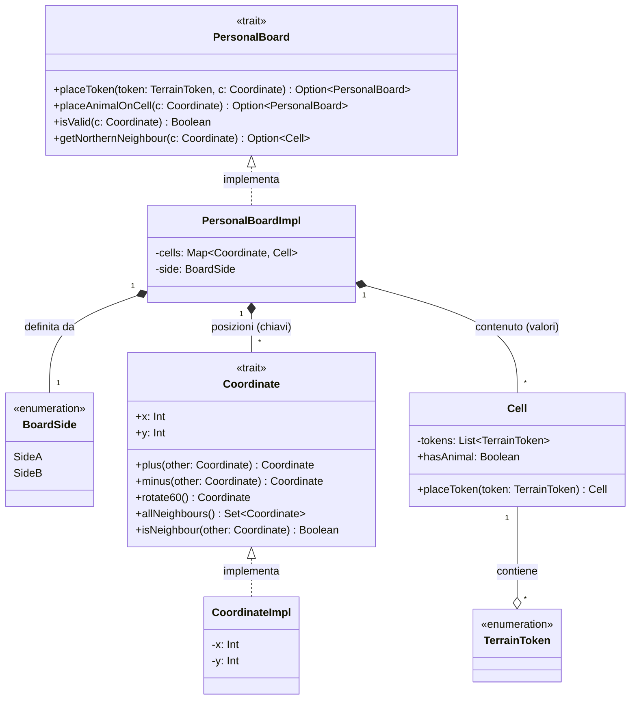
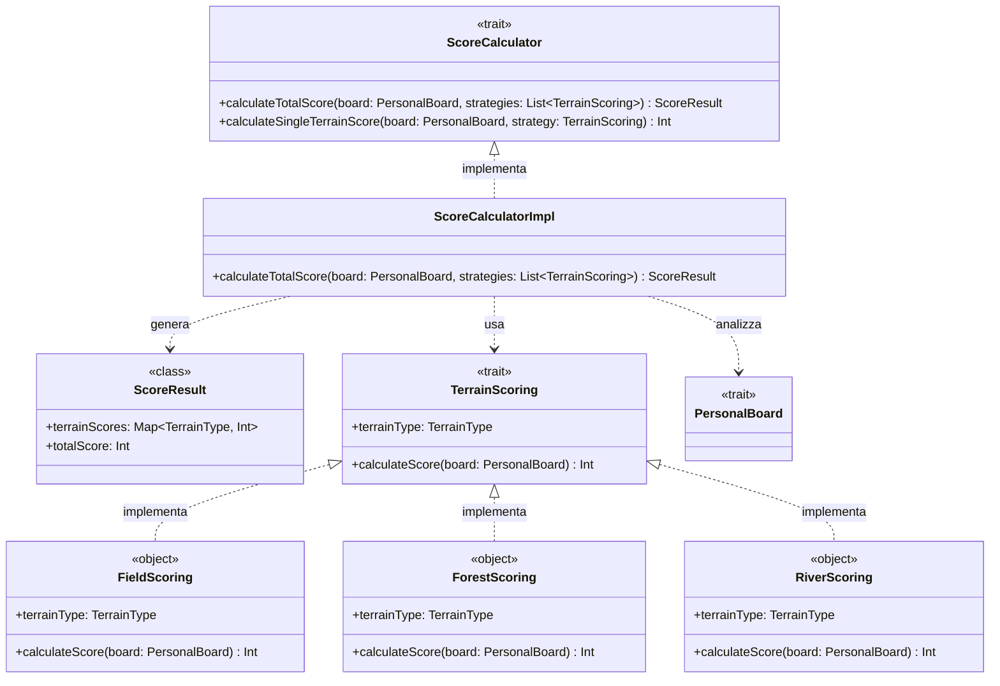

# Implementation

## Oluwatobi Daniel Ariyo
### Personal Board
#### Cell
La cella è l'elemento atomico della `PersonalBoard` e funge da contenitore per la pila di `TerrainToken` e l'eventuale cubo animale. Per preservare l'integrità del dominio, Cell è modellata come una case class immutabile: ogni modifica restituisce una nuova istanza aggiornata, coerentemente con il paradigma funzionale.
```scala
case class Cell(
                 private val tokens: List[TerrainToken] = List(),
                 hasAnimal: Boolean = false
               )
```
### Coordinate
La PersonalBoard si basa su una griglia a tassellatura esagonale. Il trait `Coordinate` definisce il contratto per le posizioni bidimensionali (x, y), fornendo le operazioni algebriche e le primitive spaziali per la navigazione sulla griglia.
```scala
trait Coordinate:
  def x: Int
  def y: Int
  def +(other: Coordinate): Coordinate
  def -(other: Coordinate): Coordinate
  def *(other: Coordinate): Coordinate
  def rotate60: Coordinate
```
Per nascondere i dettagli di basso livello e separare l'interfaccia dall'implementazione, l'interfaccia pubblica è definita dal trait Coordinate, mentre la struttura concreta è racchiusa all'interno della case class privata CoordinateImpl.
La creazione delle istanze è centralizzata nell'oggetto companion Coordinate tramite il factory method apply:
```scala
object Coordinate:
  private case class CoordinateImpl(override val x: Int, override val y: Int)
    extends Coordinate
```
L'orientamento degli esagoni prevede sei direzioni di adiacenza (Nord, Sud, Nord-Est, Nord-Ovest, Sud-Est, Sud-Ovest). 
Il trait fornisce direttamente i metodi con implementazione di default per calcolare i vicini tramite offset definiti:
```scala
def northNeighbour: Coordinate = Coordinate(x, y + 2)
def southNeighbour: Coordinate = Coordinate(x, y - 2)
def northEasternNeighbour: Coordinate = Coordinate(x + 2, y + 1)
def northWesternNeighbour: Coordinate = Coordinate(x - 2, y + 1)
def southEasternNeighbour: Coordinate = Coordinate(x + 2, y - 1)
def southWesternNeighbour: Coordinate = Coordinate(x - 2, y - 1)
```
Il metodo allNeighbours aggrega le sei direzioni in un Set[`Coordinate`], consentendo di implementare il controllo di adiacenza isNeighbour in modo snello e dichiarativo:
```scala
override def allNeighbours: Set[Coordinate] =
  Set(
    northNeighbour,
    southNeighbour,
    northEasternNeighbour,
    northWesternNeighbour,
    southEasternNeighbour,
    southWesternNeighbour
  )

override def isNeighbour(other: Coordinate): Boolean =
  allNeighbours.contains(other)
```

La PersonalBoard rappresenta la plancia di gioco individuale di ciascun giocatore.
Essa è formata da una serie di celle esagonali, `Cell` con ognuna una propria coordinata, `Coordinate`.
Il regolamento di gioco prevede due differenti configurazioni di plancia (SideA e SideB), caratterizzate da dimensioni e numero di celle differenti. 
Questa variabilità è stata modellata tramite l'enumerazione BoardSide
```scala
enum BoardSide:
  case SideA
  case SideB
```
La creazione della plancia è incapsulata nel companion object PersonalBoard, che agisce da Factory. 
Durante l'istanziazione, invoca il metodo privato generateHexGrid, il quale determina le coordinate valide della tassellatura esagonale filtrando, tramite for-comprehension, unicamente le coppie cartesiane (x, y) che rispettano i vincoli di parità esagonali. 
La struttura concreta della plancia è definita dalla case class privata PersonalBoardImpl.
```scala
private def generateHexGrid(
                             widthBound: Int,
                             heightBound: Int
                           ): Map[Coordinate, Cell] =
val validCoordinates = for
  x <- -widthBound to widthBound if x % 2 == 0
  y <- -heightBound to heightBound
  if (x / 2).abs % 2 == y.abs % 2
yield Coordinate(x, y)
validCoordinates.map(c => c -> Cell(List())).toMap


def apply(side: BoardSide): PersonalBoard = side match
  case BoardSide.SideA =>
    PersonalBoardImpl(4, 4, 23, generateHexGrid(4, 4), side)
  case BoardSide.SideB =>
    PersonalBoardImpl(6, 3, 25, generateHexGrid(6, 3), side)

```
Tutte le operazioni di interrogazione e modifica dello stato applicano la gestione difensiva tramite il tipo Option
I metodi come placeToken e placeAnimalOnCell effettuano le mutazioni senza alterare la plancia corrente,
ma restituendo un Option[`PersonalBoard`] contenente la copia aggiornata
```scala
override def placeToken(
                         token: TerrainToken,
                         c: Coordinate
                       ): Option[PersonalBoard] =
  if isValid(c) then
    cells.get(c) match
      case Some(currentCell) =>
        val updatedCell = currentCell.placeToken(token)
        val updatedCells = cells + (c -> updatedCell)
        Some(copy(cells = updatedCells))
      case None => None
  else None
```
I metodi come getNorthernNeighbour, getSouthEasternNeighbour, ecc., verificano preventivamente la validità della coordinata adiacente tramite il predicato isValid(c), restituendo None in caso di fuori bordo:
```scala
override def getNorthernNeighbour(c: Coordinate): Option[Cell] =
  if isValid(c.northNeighbour) then cells.get(c.northNeighbour) else None

private def isValid(c: Coordinate): Boolean = cells.contains(c)
```



### Calcolo del punteggio

La fase finale della partita richiede la valutazione dettagliata dei punti vittoria accumulati da ciascun giocatore sulla propria PersonalBoard e tramite le carte animale completate.
Per evitare l'utilizzo di interi generici e prevenire stati non validi (come punteggi negativi), la rappresentazione dei punti vittoria è stata modellata tramite un Opaque Type
```scala
object Score:

opaque type Score = Int

def apply(value: Int): Score =
  require(value >= 0)
value

val zero: Score = 0
```
Tramite gli extension method, il tipo Score espone operazioni algebriche sicure:
```scala
extension (s: Score)

  def +(other: Score): Score = other + s

  def -(other: Score): Score =
    val res = s - other
    if res < 0 then 0 else res

  def toInt: Int = s
```
L'astrazione per tutte le entità o regole in grado di calcolare un punteggio è definita dal trait Scorable:
```scala
trait Scorable:
  def computeScore(board: PersonalBoard): Score
```
Per la valutazione delle diverse tipologie di terreno, il trait TerrainScoring fa da ponte tra il contratto generale Scorable e la valutazione concreta della plancia:
```scala
trait TerrainScoring extends Scorable:

override def computeScore(board: Option[PersonalBoard]): Score = compute(board)

def compute(board: PersonalBoard): Score
```

Ciascuna tipologia di terreno adotta logiche di calcolo del punteggio specifiche e indipendenti. Per gestire questa variabilità è stato applicato lo Strategy Pattern: ogni tipo di terreno implementa l'interfaccia TerrainScoring all'interno di un oggetto dedicato, garantendo un'elevata modularità e la semplice estensibilità con nuove regole.
Di seguito alcuni esempi di calcolo: 

- Fields(campi) in cui ogni gruppo composto da almeno due token attribuisce 5 punti:
```scala
object FieldsScoring extends TerrainScoring:

  override def compute(board: PersonalBoard): Score =
    val allFields = board.coordsWithTerrain(TerrainToken.Field)
    val groups = board.findConnectedGroups(allFields)
    val validGroupsCount = groups.count(_.size >= 2)
Score(validGroupsCount * 5)
```

- Building(edificio) in cui ogni edificio affiancato da almeno 3 token di colore diverso vale 5 punti:
```scala
object BuildingsScoring extends TerrainScoring:

  override def compute(board: PersonalBoard): Score =
    val allBuildings = board.coordsWithTerrain(TerrainToken.Building)

    def isValidBuilding(coord: Coordinate): Boolean =
      val neighbourTerrains: Set[TerrainToken] = coord.allNeighbours
        .flatMap(board.cells.get)
        .flatMap(_.topToken)
      neighbourTerrains.size >= 3

    val validBuildingsCount = allBuildings.count(isValidBuilding)
    Score(validBuildingsCount * 5)

```





## Filippo Ferretti

## Elisa Yan
### Terrain Token
I `TerrainToken` costituiscono gli elementi principali utilizzati dai giocatori per costruire il proprio paesaggio.
La loro modellazione è stata realizzata tramite due `enum`:
- `TokenColor`, che rappresenta i colori disponibili;
- `TerrainToken`, che definisce le differenti tipologie di terreno
```scala
enum TokenColor:
  case Grey, Brown, Green, Yellow, Blue, Red

enum TerrainToken:
  case Water, Field, Mountain, Ground, Forest, Building
```
L’utilizzo di un’enumerazione permette di rappresentare un insieme chiuso di valori, evitando la creazione di tipologie di terreno non previste dal dominio.

L’oggetto `TerrainToken` contiene inoltre il metodo `colorOf`, che associa ogni terreno al colore utilizzato per la sua rappresentazione grafica:
```scala
def colorOf(token: TerrainToken): TokenColor = token match
  case TerrainToken.Water    => TokenColor.Blue
  case TerrainToken.Mountain => TokenColor.Grey
  case TerrainToken.Forest   => TokenColor.Green
  case TerrainToken.Field    => TokenColor.Yellow
  case TerrainToken.Building => TokenColor.Red
  case TerrainToken.Ground   => TokenColor.Brown
```
La corrispondenza viene definita tramite pattern matching, rendendo esplicita e type-safe l’associazione tra ogni token e il relativo colore.

### Terrain Token Placement
L’implementazione delle regole di piazzamento dei `TerrainToken` è stata sviluppata separando la validazione dalla logica di gioco. 
La classe `TokenValidator` contiene esclusivamente le regole di piazzamento, mentre `GameModel` coordina il flusso del turno.

La validazione sfrutta il _pattern matching_ sugli `enum`, in cui ogni tipo di token definisce in maniera dichiarativa le proprie regole di sovrapposizione,
rendendo l'implementazione estendibile.

#### Higher-Order Function (HOF)
Per individuare le celle valide è stata inoltre introdotta una _Higher-Order Function_ (HOF) che astrae il meccanismo di ricerca delle coordinate, 
ricevendo come parametro una funzione predicato (`Cell => Boolean`) che descrive il criterio di selezione.
```scala
private val findCoordinates = (board: PersonalBoard, predicate: Cell => Boolean) => 
  board.cells.collect{
    case (coordinate, cell) if predicate(cell) => coordinate
  }.toList
```
La funzione `validPositions` delega la ricerca delle coordinate alla HOF, limitandosi a fornire il predicato di validazione. La `PersonalBoard` necessaria alla ricerca viene invece ottenuta come parametro contestuale tramite `using`, evitando di doverla passare esplicitamente a ogni invocazione.
```scala
def validPositions(token: TerrainToken)(using board: PersonalBoard): List[Coordinate] =
    findCoordinates(board, canPlace(token, _))
```

#### Contextual Abstractions: `using` e `given`
Per evitare di propagare esplicitamente la plancia del giocatore lungo tutta la catena di chiamate, l’implementazione sfrutta le _Contextual Abstractions_ tramite using e given.
Il metodo `validPositions` dichiara infatti la dipendenza da una `PersonalBoard` come parametro contestuale:
```scala
def validPositions(token: TerrainToken)(using board: PersonalBoard): List[Coordinate] =
  findCoordinates(board, canPlace(token, _))
```
Nel `GameModel` la plancia del giocatore corrente viene resa disponibile come valore contestuale:
```scala
private given currentBoard: PersonalBoard = currentPlayer.board
```
Di conseguenza, l’invocazione del metodo non richiede più il passaggio esplicito della plancia, scala risolve automaticamente il parametro contestuale utilizzando il `given` disponibile nello scope.
```scala
TokenValidator.validPositions(token)
```

### Turn Management
La gestione del turno è modellata attraverso l'enumerazione `TurnState`, che sfrutta gli _Algebraic Data Types_ per rappresentare l'insieme finito degli stati che un turno può assumere.
In particolare, il turno può trovarsi in uno dei tre stati `WaitingForAction`, `ActionDone` oppure `TurnComplete`. 
Questa rappresentazione rende esplicite le possibili fasi del turno e impedisce la presenza di stati non validi.
```scala
enum TurnState:
  case WaitingForAction
  case ActionDone
  case TurnComplete
```
Le transizioni tra gli stati sono gestite direttamente dal `GameModel`, che rappresenta lo stato complessivo della partita.
Prima di eseguire un'operazione, il model verifica che essa sia consentita nello stato corrente; in caso contrario viene lanciata un'eccezione.
Ogni operazione valida restituisce una nuova istanza aggiornata del model attraverso il metodo `copy`, preservando l'immutabilità dello stato di gioco.

Lo stato `WaitingForAction` rappresenta l’inizio del turno. In questa fase il giocatore può prendere una carta animale, 
purché non ne abbia già presa una durante lo stesso turno e non abbia raggiunto il numero massimo di carte attive. 
Può inoltre scegliere uno degli slot di `TerrainToken` disponibili sulla plancia centrale.
Il prelievo dei token viene eseguito tramite il metodo `takeTokens` ed è consentito esclusivamente nello stato `WaitingForAction`:

Nello stato `ActionDone` il giocatore può selezionare e posizionare i token appena ottenuti sulla propria `PersonalBoard`. 
Se non ha ancora preso una carta animale durante il turno corrente, può ancora effettuare tale operazione. 
Dopo ogni piazzamento il model aggiorna il numero di token rimanenti nella mano del giocatore; quando tutti i token sono stati collocati, il turno passa automaticamente allo stato `TurnComplete`.

Infine, nello stato `TurnComplete`, il giocatore non può più eseguire ulteriori azioni e può solamente terminare il turno. 
L’operazione di fine turno aggiorna la plancia centrale, passa il controllo al giocatore successivo e riporta il `TurnState` a `WaitingForAction`, avviando un nuovo ciclo.

La Figura seguente mostra la macchina a stati finiti che descrive le transizioni del turno.


### Player
Il giocatore è rappresentato dalla `case class Player`, che raccoglie tutte le informazioni necessarie per descrivere lo stato di un partecipante durante la partita.
```scala
case class Player(
    id: Int,
    name: String,
    board: PersonalBoard,
    activeCards: List[AnimalCard] = List.empty,
    completedCards: List[AnimalCard] = List.empty
)
```
Ogni giocatore mantiene:
- la propria `PersonalBoard`;
- l'insieme delle carte animale ancora in gioco (`activeCards`);
- le carte completate (`completedCards`).
La struttura risulta una rappresentazione compatta dello stato del giocatore, lasciando la logica di gioco al `GameModel`.

#### Extension Methods
Per evitare di inserire nella `case class` metodi legati a specifiche regole del gioco, è stato utilizzato un _extension method_.
```scala
object Player:

  extension (player: Player)

    def hasReachedAnimalCardLimit(limit: Int): Boolean =
      player.activeCards.size >= limit
```
L’_extension method_ aggiunge un nuovo comportamento al tipo `Player` senza modificarne la definizione originale, mantenendo separata la rappresentazione dei dati dalla logica applicativa.
Nel `GameModel` il controllo diventa quindi:
```scala
if currentPlayer.hasReachedAnimalCardLimit(MaxAnimalCards) then
  throw IllegalStateException(
    "Player ha già il numero massimo di carte animale"
  )
```
Questa soluzione rende il codice riutilizzabile in altre parti dell'applicazione.
