title: Requirement specification
nav_order: 2
parent: Report

# Requirement specification

## 1. Business Requirements

Il progetto "Scalarmonies" mira a realizzare una simulazione digitale e interattiva del gioco da tavolo *Harmonies*, supportando da 1 a 4 giocatori con un'interfaccia grafica minimale. L'obiettivo principale è fornire un sistema stabile che automatizzi il flusso dei turni, il rispetto dei vincoli spaziali e il calcolo dei punteggi.

In ambito accademico, il successo di questo progetto sarà determinato dal soddisfacimento dei seguenti obiettivi:
* Consolidare la padronanza di concetti avanzati in Scala 3 (es. monadi, Algebraic Data Types, higher-order functions).
* Sfruttare rigorosamente il paradigma di programmazione funzionale, prediligendo l'immutabilità degli stati.
* Adottare tecniche di Test Driven Development (TDD) per validare le meccaniche di base.
* Applicare metodologie agili e pratiche DevOps per la gestione del processo, includendo GitFlow, Continuous Integration (CI) tramite GitHub Actions e automazione della build (SBT).

## 2. Modello di Dominio

All'interno delle dinamiche logiche e strutturali di *Harmonies*, i componenti chiave del gioco assumono i seguenti ruoli formali:

* **Pouch (Sacchetto):** Funge da riserva generale per i token. Il suo ruolo è garantire la casualità e l'imparzialità durante il rifornimento del mercato centrale a ogni turno.

* **Central Board (Tabellone Centrale):** È lo spazio comune condiviso da tutti i giocatori. Ospita il mercato dei token disponibili per il prelievo e organizza l'offerta pubblica delle carte.

* **Personal Board (Plancia Personale):** Rappresenta l'ecosistema individuo di ciascun giocatore. È la griglia esagonale tridimensionale in cui vengono posizionati i token per creare i paesaggi e soddisfare i pattern geometrici richiesti.

* **Reminder Card (Promemoria):** Funge da riferimento rapido e scheda riassuntiva delle regole di punteggio. Mostra visivamente come i diversi tipi di terreno (alberi, montagne, campi, ecc.) si connettono e si evolvono in altezza per generare punti alla fine della partita.

* **Tokens:** Sono gli elementi costruttivi fondamentali del gioco. Rappresentano i vari tipi di habitat naturali (come foreste, montagne, acqua, campi o edifici) che i giocatori combinano e impilano sulla propria plancia per dare forma al territorio.

* **Animal Cubes (Cubi Animale):** Agiscono come marcatori di popolamento. Vengono inizialmente posizionati sulle carte animale e si spostano sulla plancia personale del giocatore non appena l'habitat corrispondente soddisfa i requisiti di configurazione geometrica richiesti.

* **Nature's Spirit Cubes (Cubi Spirito della Natura):** Sono cubetti speciali associati esclusivamente alle divinità o agli spiriti guardiani del gioco. Seguono regole di piazzamento e di punteggio uniche e più complesse rispetto ai normali cubetti animale.

* **Animal Cards (Carte Animale):** Rappresentano gli obiettivi. Ogni carta mostra un pattern geometrico specifico (visto dall'alto e in altezza) che la fauna richiede per potersi insediare nel paesaggio creato dal giocatore, fornendo punti vittoria in base a quanti cubetti vengono trasferiti.

* **Nature’s Spirit Cards (Carte Spirito della Natura):** Rappresentano elementi mitici o obiettivi speciali di alto livello. Introducono modi alternativi e asimmetrici per fare punti o per connettere i terreni, influenzando in modo significativo la strategia di pianificazione a lungo termine sulla plancia personale.

Al fine di analizzare il sistema sia sotto l'aspetto statico che dinamico, la struttura del gioco è stata formalizzata attraverso due diagrammi UML complementari.

L'obiettivo è definire in modo rigoroso le relazioni intercorrenti tra le principali entità del dominio e mappare l'insieme delle azioni che un giocatore può compiere durante il proprio turno.

```mermaid
classDiagram
    Card <|-- AnimalCard 
    Card <|-- SpiritNatureCard 
    
    Cube <|-- AnimalCube 
    Cube <|-- SpiritNatureCube

    Player "1" -- "0..1" Card : draws
    Player "1" -- "*" Token : places
    Player "1" -- "1" Board : has
    Board "1" -- "1..*" Cell : made of
    
    Card "1" -- "1" Habitat : has
    Habitat "*" -- "2..3" Token : composed of
    
    Cell "0..*" -- "0..*" Token : hosts
    Cell "0..*" -- "1" Cube : hosts

    class Player {
        
    }
    class Board {
        
    }
    class Card {
        
    }
    class AnimalCard {
        
    }
    class SpiritNatureCard {
        
    }
    class Habitat {
        
    }
    class Token {
        
    }
    class Cell {
        
    }
    class Cube {
        
    }
    class AnimalCube {
        
    }
    class SpiritNatureCube {
        
    }
```

## 3. Requisiti Funzionali

### 3.1 Requisiti Utente (FR-U)
L'utente deve poter:
* Selezionare il numero di giocatori (da 1 a 4) per avviare la partita.
* Selezionare, durante il proprio turno, un set composto da tre dischi terreno dall'offerta comune.
* Cliccare sulla propria plancia individuale per posizionare i dischi, rispettando i vincoli di impilamento.
* Acquisire carte animale dall'offerta comune.
* Posizionare un segnalino animale su una cella valida della plancia per completare il pattern di una carta.
* Visualizzare la classifica finale e i punteggi al termine della partita.

**Funzionalità Opzionali:**
* Giocare in modalità singleplayer contro avversari virtuali gestiti tramite euristiche.
* Abilitare le carte "Spiriti della Natura".

### 3.2 Requisiti di Sistema (FR-S)
Il sistema deve:
* Gestire l'inizio della partita, popolare il tabellone centrale dei dischi ed estrarre le carte animale iniziali.
* Estrarre casualmente i dischi dal sacchetto per ripristinare il tabellone centrale a ogni round.
* Validare il posizionamento dei dischi, impedendo mosse geometricamente illegali o fuori dai bordi della plancia.
* Scansionare la plancia per eseguire il pattern matching delle conformazioni richieste dalle carte animale.
* Calcolare ricorsivamente il punteggio finale sommando i punti derivanti dagli habitat e dagli animali ospitati.
* Rilevare le condizioni di fine partita, ovvero l'esaurimento dei dischi o il popolamento delle celle necessarie da parte di uno dei due giocatori.

## 4. Requisiti Non Funzionali (NFR)

* **Robustezza (Gestione Errori):** Il motore logico non deve lanciare eccezioni a runtime per stati invalidi, ma gestirli puramente a livello funzionale tramite `Either`, `Option` o `Try`.
* **Testabilità:** La logica del dominio deve essere isolata dalla UI e coperta da test unitari automatizzati.
* **Performance** L'interfaccia utente deve fornire un feedback reattivo. Nella modalità opzionale singleplayer, il calcolo delle mosse dell'avversario virtuale non deve bloccare il thread della UI.

## 5. Requisiti Di Implementazione (IR)

* Il sistema deve essere sviluppato in Scala 3.
* Il design deve aderire all'architettura a livelli (MVC).
* Deve essere utilizzato un framework grafico per la View.
* Il codice sorgente deve essere tracciato tramite Git e supportato da una pipeline di Continuous Integration.